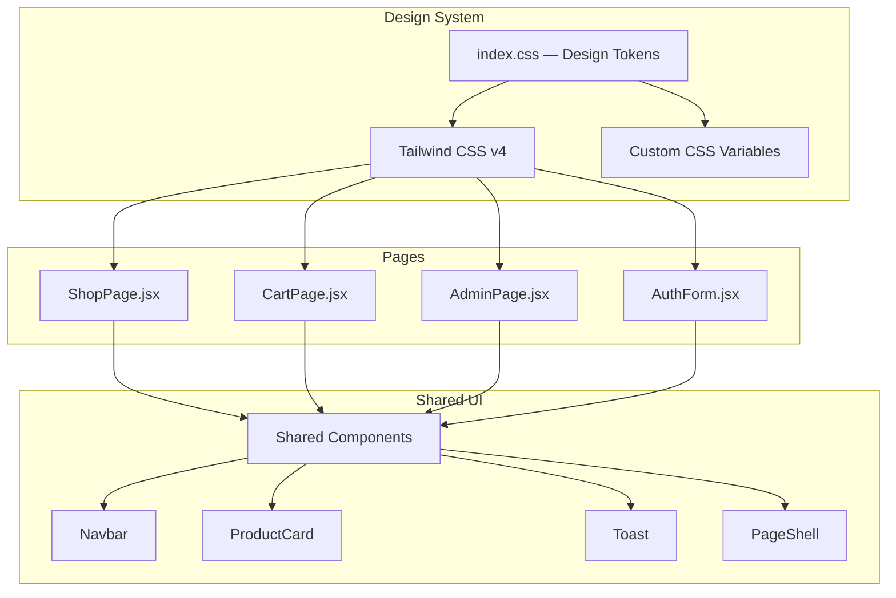
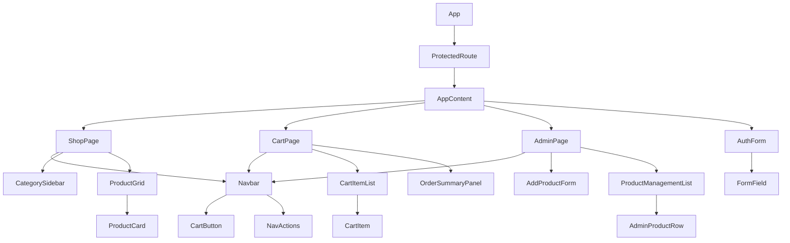
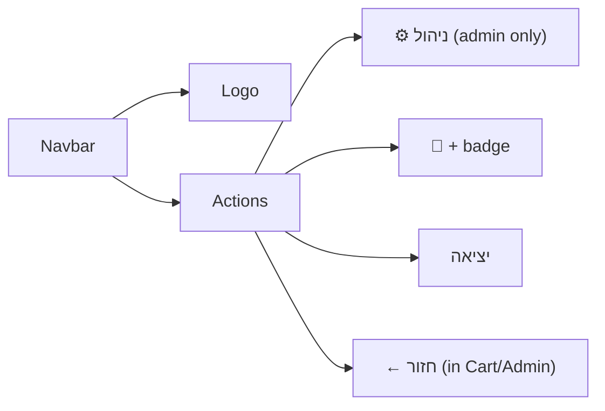

# Design Document: Bakery Shop Redesign

## Overview

עיצוב מחדש מקיף של אפליקציית המאפייה — מעבר לשפת עיצוב אחידה, נקייה ומודרנית המבוססת על Tailwind CSS v4 לכל הדפים. הפרויקט מחליף את `App.css` עם classes ישנות בתשתית Tailwind עקבית, מגדיר מערכת עיצוב (Design System) מרוכזת ב-`index.css`, ומשדרג את פריסת ה-CSS Grid בכל העמודים לפריסה רספונסיבית, RTL-first ונגישה.

---

## ארכיטקטורת עיצוב



---

## מערכת צבעים (Color System)

פלטת צבעים חמה ועקבית לאורך כל האפליקציה — מבוססת על גוני ענבר, קרם וחום.

### טוקנים ב-`index.css`

```css
@import "tailwindcss";

@theme {
  /* ── Brand palette ── */
  --color-cream-50:  #fdf8f2;
  --color-cream-100: #faf0e4;
  --color-cream-200: #f3dfc6;

  --color-amber-400: #f5a623;
  --color-amber-500: #e8922a;
  --color-amber-600: #d97c1f;
  --color-amber-700: #c26a10;

  --color-brown-700: #7a4f2e;
  --color-brown-800: #5c3520;
  --color-brown-900: #3b2a1a;

  --color-surface:   #ffffff;
  --color-bg:        var(--color-cream-50);

  /* ── Semantic tokens ── */
  --color-primary:        var(--color-brown-900);
  --color-primary-hover:  var(--color-brown-800);
  --color-accent:         var(--color-amber-600);
  --color-accent-hover:   var(--color-amber-700);
  --color-text-body:      var(--color-brown-900);
  --color-text-muted:     var(--color-brown-700);
  --color-border:         var(--color-cream-200);

  /* ── Typography ── */
  --font-sans: 'Segoe UI', system-ui, sans-serif;
}

:root {
  direction: rtl;
  font-family: var(--font-sans);
  background-color: var(--color-bg);
  color: var(--color-text-body);
  -webkit-font-smoothing: antialiased;
}

#root {
  width: 100%;
  max-width: 100%;
  margin: 0;
  border: none;
  text-align: right;
}
```

### טבלת צבעים

| טוקן | ערך | שימוש |
|------|-----|--------|
| `bg` | `#fdf8f2` | רקע כללי של האפליקציה |
| `surface` | `#ffffff` | כרטיסים, panels, forms |
| `brown-900` | `#3b2a1a` | Primary button, navbar BG |
| `amber-600` | `#d97c1f` | Accent, CTA, badge, hover |
| `brown-700` | `#7a4f2e` | Muted text, labels, captions |
| `cream-200` | `#f3dfc6` | Borders, dividers |

---

## מערכת טיפוגרפיה

```
Display  — font-size: 2rem,   font-weight: 800, letter-spacing: -0.5px
Title    — font-size: 1.5rem, font-weight: 700
Heading  — font-size: 1.25rem, font-weight: 700
Body     — font-size: 1rem,   font-weight: 400, line-height: 1.6
Small    — font-size: 0.875rem, font-weight: 400
Caption  — font-size: 0.75rem,  font-weight: 600, uppercase, letter-spacing: wider
```

גופן: `'Segoe UI'` → `system-ui` → `sans-serif`  
כיוון: `dir="rtl"` על כל הדפים. כל הטקסט מיושר לימין.

---

## היררכיית רכיבים (Component Hierarchy)



### רכיבים משותפים חדשים

| רכיב | תיאור | מיקום |
|------|--------|--------|
| `Navbar` | ניווט עליון sticky, לוגו + פעולות | `src/components/Navbar.jsx` |
| `PageShell` | wrapper עם `dir="rtl"`, min-h-screen, bg | inline per-page |
| `Toast` | הודעות toast קיים | `src/Toast.jsx` — ללא שינוי |

---

## פריסות Grid — כל הדפים

### ShopPage — Two-Column Layout

```
┌────────────────────────────────────────────────────────┐
│  Navbar (sticky, full-width)                           │
├──────────────┬─────────────────────────────────────────┤
│              │                                         │
│  Category    │  Product Grid                           │
│  Sidebar     │  [1 col → 2 col md → 3 col lg]          │
│  (sticky,    │                                         │
│   1/4 width) │  Category Section 1                     │
│              │  ┌──────┐ ┌──────┐ ┌──────┐            │
│  • לחמים     │  │ card │ │ card │ │ card │            │
│  • עוגות  ◀  │  └──────┘ └──────┘ └──────┘            │
│  • מאפים     │                                         │
│              │  Category Section 2                     │
│              │  ┌──────┐ ┌──────┐                      │
│              │  │ card │ │ card │                      │
└──────────────┴─────────────────────────────────────────┘
```

**Tailwind Grid:**
```
Main container: grid grid-cols-1 lg:grid-cols-[260px_1fr] gap-8
Product grid:   grid grid-cols-1 sm:grid-cols-2 xl:grid-cols-3 gap-6
```

**Mobile:** sidebar מוסתרת (`hidden lg:block`), product grid עמודה אחת.

---

### CartPage — Two-Column Layout

```
┌────────────────────────────────────────────────────────┐
│  Navbar (sticky, full-width)                           │
├────────────────────────────┬───────────────────────────┤
│                            │                           │
│  Cart Items (1fr)          │  Order Summary (300px)    │
│  ┌──────────────────────┐  │  ┌─────────────────────┐  │
│  │ img │ name │ qty │ ₪ │  │  │  סיכום הזמנה        │  │
│  └──────────────────────┘  │  │  פריטים: 3          │  │
│  ┌──────────────────────┐  │  │  סה"כ: ₪120         │  │
│  │ img │ name │ qty │ ₪ │  │  │  [לתשלום →]         │  │
│  └──────────────────────┘  │  └─────────────────────┘  │
│                            │                           │
└────────────────────────────┴───────────────────────────┘
```

**Tailwind Grid:**
```
Cart layout: grid grid-cols-1 lg:grid-cols-[1fr_300px] gap-8 items-start
```

**Mobile:** עמודה אחת — פריטים למעלה, סיכום למטה.

---

### AdminPage — Single Column with Form Grid

```
┌────────────────────────────────────────────────────────┐
│  Navbar (sticky, full-width)                           │
├────────────────────────────────────────────────────────┤
│  ┌──────────────────────────────────────────────────┐  │
│  │  הוספת מוצר חדש                                  │  │
│  │  ┌────────┐ ┌────────┐ ┌────────┐ ┌──────────┐  │  │
│  │  │שם פריט│ │ מחיר   │ │קטגוריה │ │  תיאור   │  │  │
│  │  └────────┘ └────────┘ └────────┘ └──────────┘  │  │
│  │  [+ הוסף מוצר]                                   │  │
│  └──────────────────────────────────────────────────┘  │
│  ┌──────────────────────────────────────────────────┐  │
│  │  ניהול מוצרים                                    │  │
│  │  ┌─────────────────────────────────────────────┐ │  │
│  │  │ img │ שם │ [מחיר] │ [זמינות] │ [הערה] │ 🗑  │ │  │
│  │  └─────────────────────────────────────────────┘ │  │
│  └──────────────────────────────────────────────────┘  │
└────────────────────────────────────────────────────────┘
```

**Tailwind Grid:**
```
Add form grid: grid grid-cols-1 sm:grid-cols-2 lg:grid-cols-[1fr_1fr_1fr_1fr_auto] gap-3
Product row:   flex items-center flex-wrap gap-4 (RTL)
```

---

### AuthForm — Centered Card

```
┌────────────────────────────────────────────────────────┐
│                                                        │
│              ┌──────────────────────┐                  │
│              │   🥐 The Bakery      │                  │
│              │                      │                  │
│              │  [  אימייל         ] │                  │
│              │  [  סיסמה          ] │                  │
│              │  [    התחבר        ] │                  │
│              │  אין לך חשבון? הירשם │                  │
│              └──────────────────────┘                  │
│                                                        │
└────────────────────────────────────────────────────────┘
```

**Tailwind:**
```
Page:  min-h-screen bg-[--color-bg] flex items-center justify-center
Card:  w-full max-w-sm bg-white rounded-2xl shadow-lg p-8
```

---

## Navbar — אנטומיה ומצבים



**מבנה:**
```
sticky top-0 z-50
bg-white/95 backdrop-blur-sm
border-b border-[--color-border]
shadow-sm

inner: max-w-7xl mx-auto px-6 h-16
       flex items-center justify-between
       dir="rtl"
```

**Cart button states:**
- ריק: `bg-brown-900 text-white rounded-full px-4 py-2`
- יש פריטים: + badge `bg-amber-500` מעוגל, מספר מרכזי

---

## ProductCard — אנטומיה ומצבים

```
┌──────────────────────┐
│   [  תמונה  ]        │  h-48, object-cover
│   [overlay: לא זמין] │  bg-white/70 (conditional)
├──────────────────────┤
│  שם המוצר            │  font-bold text-lg RTL
│  תיאור קצר...        │  text-sm text-muted line-clamp-2
│                      │
│  ─────────────────   │  divider
│  ₪XX    [+ הוסף]     │  space-between
└──────────────────────┘
```

**מצבים:**
| מצב | שינוי ויזואלי |
|-----|--------------|
| Default | `shadow-sm border border-cream-200` |
| Hover | `shadow-md -translate-y-0.5` (transition) |
| Loading (addingId) | כפתור `opacity-60 cursor-wait`, טקסט `...` |
| Unavailable | overlay לבן שקוף, כפתור `bg-gray-200 text-gray-400 cursor-not-allowed` |

---

## Cart Item — אנטומיה

```
┌─────────────────────────────────────────────────────────┐
│  [img 72×72]  שם הפריט          [qty −/+]  ₪XX   [🗑]   │
└─────────────────────────────────────────────────────────┘
```

- `flex items-center gap-4` (RTL — הסדר מימין לשמאל)
- תמונה: `w-18 h-18 rounded-xl object-cover flex-shrink-0`
- Quantity selector: `flex items-center gap-2 bg-cream-100 rounded-lg px-3 py-1`
- Remove btn: `text-gray-400 hover:text-red-500 transition-colors`

---

## Order Summary Panel — אנטומיה

```
┌──────────────────────────┐
│  סיכום הזמנה             │  heading
│  ─────────────────────   │
│  סה"כ פריטים    3        │  summary-row
│  ─────────────────────   │
│  סה"כ לתשלום  ₪120       │  summary-total (bold)
│  [      לתשלום →       ] │  CTA button full-width
└──────────────────────────┘
```

- Panel: `bg-white rounded-2xl p-6 shadow-sm border border-cream-200 sticky top-24`
- CTA: `w-full py-3 bg-amber-600 hover:bg-amber-700 text-white font-semibold rounded-xl transition-colors`

---

## Admin Section Panel

```
bg-white rounded-2xl p-6 shadow-sm border border-cream-200
max-w-5xl mx-auto mb-8
```

**Admin Product Row:**
- `flex flex-wrap items-center gap-4 py-4 border-b border-cream-100`
- תמונה: `w-16 h-16 rounded-xl object-cover`
- Price input: `w-20 px-2 py-1.5 border border-cream-200 rounded-lg text-sm`
- Save btn: `px-3 py-1.5 bg-brown-900 hover:bg-amber-600 text-white text-xs rounded-lg`
- Toggle btn available: `px-3 py-1.5 bg-green-100 text-green-800 rounded-full text-sm font-medium`
- Toggle btn unavailable: `px-3 py-1.5 bg-red-100 text-red-800 rounded-full text-sm font-medium`
- Delete btn: `text-red-400 hover:text-red-600 hover:bg-red-50 rounded-lg px-2 py-1`

---

## תכנית הגירה — App.css → Tailwind

### שלב 1: עדכון `index.css`
- הסרת כל ה-CSS variables הגנריים (purple accent, כו')
- הוספת Design Tokens המוגדרים לעיל ב-`@theme {}`
- תיקון `#root` להסרת `width: 1126px` ו-`border-inline`

### שלב 2: CartPage.jsx
**Classes להחליף:**

| App.css class | Tailwind replacement |
|---------------|---------------------|
| `<header>` raw tag | `<header className="sticky top-0 z-50 bg-white border-b ...">` |
| `.cart-layout` | `grid grid-cols-1 lg:grid-cols-[1fr_300px] gap-8 items-start` |
| `.cart-items` | `flex flex-col gap-4` |
| `.cart-item` | `flex items-center gap-4 bg-white rounded-2xl p-4 shadow-sm border border-cream-200` |
| `.cart-item-info` | `flex-1 min-w-0` |
| `.qty-selector` | `flex items-center gap-2 bg-cream-50 rounded-lg px-3 py-1` |
| `.qty-btn` | `w-7 h-7 flex items-center justify-center rounded-lg hover:bg-amber-600 hover:text-white transition-colors` |
| `.order-summary` | `bg-white rounded-2xl p-6 shadow-sm border border-cream-200 sticky top-24` |
| `.checkout-btn` | `w-full py-3 bg-amber-600 hover:bg-amber-700 text-white font-semibold rounded-xl transition-colors` |
| `.empty-cart` | `flex flex-col items-center justify-center py-24 gap-4` |
| `.outline-btn` | `px-4 py-2 border-2 border-white text-white rounded-lg hover:bg-white/15 transition text-sm` |

### שלב 3: AdminPage.jsx
**Classes להחליף:**

| App.css class | Tailwind replacement |
|---------------|---------------------|
| `<header>` raw tag | Navbar component |
| `.admin-section` | `bg-white rounded-2xl p-6 shadow-sm border border-cream-200 max-w-5xl mx-auto mb-8` |
| `.admin-form` | `grid grid-cols-1 sm:grid-cols-2 lg:grid-cols-[repeat(4,1fr)_auto] gap-3 items-end` |
| `.admin-form input` | `px-3 py-2 border border-cream-200 rounded-lg text-sm w-full` |
| `.admin-product-row` | `flex flex-wrap items-center gap-4 py-4 border-b border-cream-100` |
| `.admin-field-group` | `flex flex-col gap-1` |
| `.admin-field-group label` | `text-xs font-semibold text-brown-700` |
| `.admin-price-input` | `w-20 px-2 py-1.5 border border-cream-200 rounded-lg text-sm` |
| `.admin-save-btn` | `px-3 py-1.5 bg-brown-900 hover:bg-amber-600 text-white text-xs rounded-lg transition-colors` |
| `.toggle-on` | `px-3 py-1.5 bg-green-100 text-green-800 rounded-full text-sm font-medium` |
| `.toggle-off` | `px-3 py-1.5 bg-red-100 text-red-800 rounded-full text-sm font-medium` |
| `.admin-delete` / `.remove-btn` | `text-red-400 hover:text-red-600 hover:bg-red-50 rounded-lg px-2 py-1 transition-colors` |

### שלב 4: AuthForm.jsx
**Classes להחליף:**

| App.css class | Tailwind replacement |
|---------------|---------------------|
| `.auth-form` | `w-full max-w-sm mx-auto bg-white rounded-2xl shadow-lg p-8 text-right` |
| `.auth-form h2` | `text-2xl font-bold text-brown-900 mb-6` |
| `.auth-form input` | `w-full px-4 py-2.5 border border-cream-200 rounded-xl text-sm mb-3 focus:outline-none focus:ring-2 focus:ring-amber-400` |
| `.auth-form button` | `w-full py-2.5 bg-brown-900 hover:bg-amber-600 text-white font-semibold rounded-xl transition-colors` |
| `.field-error` | `text-red-500 text-xs mb-2 text-right` |
| `.auth-toggle` | `text-sm text-brown-700 hover:text-amber-600 cursor-pointer mt-2` |

### שלב 5: ניקוי `App.css`
לאחר שכל הדפים עברו ל-Tailwind, ניתן להסיר את כל ה-classes הישנות מ-`App.css`. ניתן לשמור רק:
```css
/* Utility classes not covered by Tailwind */
.line-clamp-2 { /* already in Tailwind v3+ */ }
```
בפועל — `App.css` יכול להיות ריק לגמרי.

---

## רספונסיביות — Breakpoints

| Breakpoint | רוחב | שינויים עיקריים |
|-----------|------|----------------|
| `sm` | 640px | Admin form → 2 עמודות |
| `md` | 768px | Product grid → 2 עמודות |
| `lg` | 1024px | Sidebar מופיעה, cart layout → 2 עמודות |
| `xl` | 1280px | Product grid → 3 עמודות |

---

## נגישות (Accessibility)

- `dir="rtl"` על כל containers ראשיים
- `aria-label` על כל הכפתורים האינטראקטיביים (כבר קיים ב-ShopPage, להוסיף לדפים האחרים)
- `role="group"` על qty-selector
- `aria-label` על cart items section
- כל ה-inputs מקושרים ל-labels ב-AdminPage
- צבע contrast: brown-900 על cream-50 עובר WCAG AA
- Focus rings: `focus:ring-2 focus:ring-amber-400 focus:ring-offset-1`

---

## תלויות ושינויים בקבצים

| קובץ | פעולה |
|------|-------|
| `src/index.css` | עדכון — החלפת tokens לפלטת מאפייה |
| `src/App.css` | ניקוי — הסרת כל classes שעוברות ל-Tailwind |
| `src/pages/CartPage.jsx` | עדכון — מעבר מלא ל-Tailwind |
| `src/pages/AdminPage.jsx` | עדכון — מעבר מלא ל-Tailwind |
| `src/components/AuthForm.jsx` | עדכון — מעבר מלא ל-Tailwind |
| `src/pages/ShopPage.jsx` | עדכון קל — שימוש בטוקני הצבע החדשים |
| `src/App.jsx` | ללא שינוי |
| `src/components/Navbar.jsx` | חדש — רכיב Navbar משותף (אופציונלי) |
